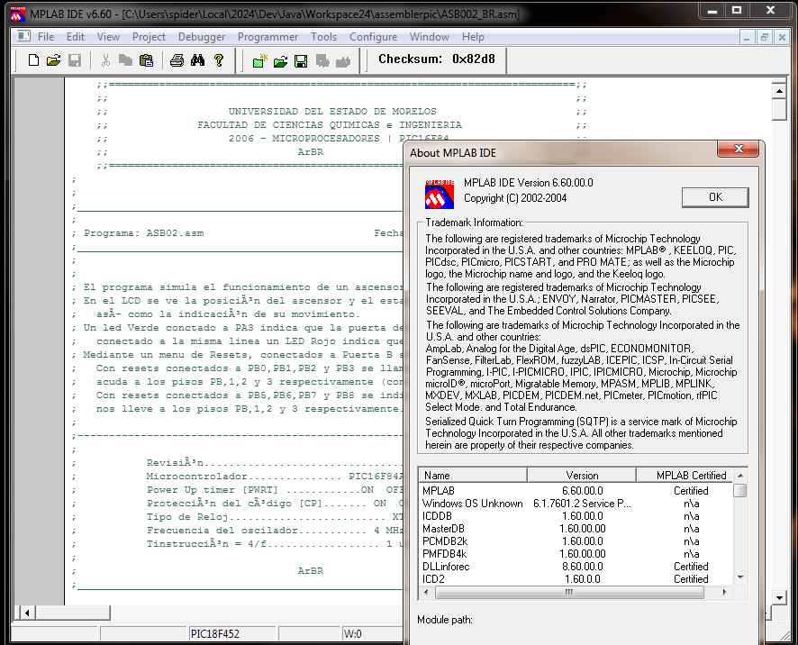
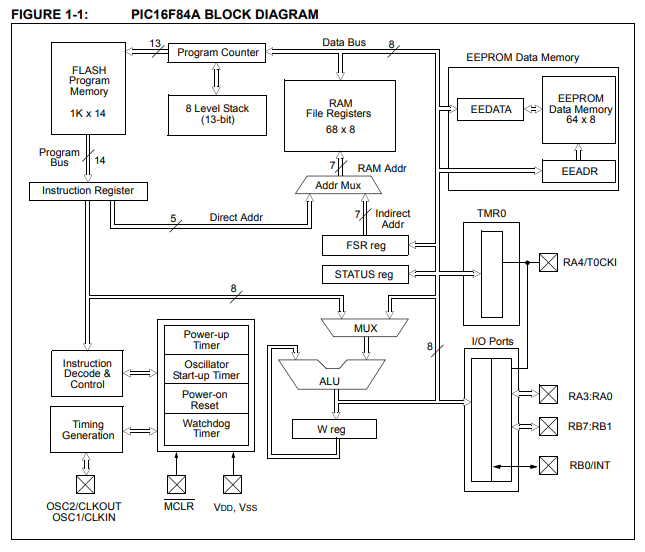

# ASB002_BR.asm

*This assembly program (ASB002_BR.asm) emulates the operation of a four-floor elevator using a PIC16F84 microcontroller*. The program manages the elevator's position, door status, and movement indications displayed on an LCD screen. It integrates input from push-button switches and provides visual indication through LEDs to represent the door's state (open or closed).

[Read more about Theory of Control and Control Systems (in Spanish)](./control-systems.md)

## PIC16F84

The **PIC16F84 is a microcontroller** from Microchip Technology. It's a popular choice due to its simplicity, versatility, and wide support. The PIC16F84 is ideal for small-scale automation, interfacing sensors, and learning embedded systems.

## PIC16F84 features

- Flash Memory: 1KB (rewritable, easy for development)
- RAM: 68 bytes (for temporary data storage)
- EEPROM: 64 bytes (for non-volatile data storage)
- GPIO Ports:
  - PORT-A: 5 pins (RA0-RA4)
  - PORT-B: 8 pins (RB0-RB7)
- Clock Speed: Up to 20 MHz with an external crystal oscillator.
- Timers: 1 hardware timer (Timer0).
- Interrupts: Support for external and internal interrupts.
- I/O Pins: Configurable as input or output.

## Steps for programming PIC16F84

1. Write the Code: Use assembly language to define the program logic.

2. Assemble the Code: Use an assembler like MPASM to convert the code into a .hex file.

3. Load the Program: Use a device-programmer (e.g., PICkit) to upload the .hex file onto the microcontroller.

4. Test: Connect the PIC to the required circuit (e.g., LEDs, sensors) and power it up.

## MPLAB IDE

The MPLAB IDE is a development environment by Microchip Technology for programming and debugging their microcontrollers, including the PIC16F84. It supports writing, compiling, and debugging assembler and C code.

Features of MPLAB IDE for PIC16F84:
- Code Editor: Syntax highlighting and templates for assembly language.
- Debugger: Simulate code execution with step-by-step debugging. Inspect register and memory values.
- Integration with Tools: Supports various Microchip programmers and debuggers.
- Simulator: Test your code without needing hardware.



## PIC16F84A data-sheet

*<<The PIC16F84A data-sheet document contains device specific information for the operation of the PIC16F84A device. The Reference Manual should be considered a complementary document to this data sheet, and is highly recommended reading for a better understanding of the
device architecture and operation of the peripheral
modules. The PIC16F84A belongs to the mid-range family of the
PICmicro microcontroller devices. A block diagram of
the device is shown in Figure 1-1.>>*

PIC16F84 reference: https://www.microchip.com/en-us/product/PIC16F84

PIC16F84 data-sheet: https://ww1.microchip.com/downloads/en/devicedoc/35007b.pdf





## Assembly routines for the PIC16F84

```asm
;______________________________________________________________________________________________________;
;Bucle principal del programa.
;

MAIN		
		call	PB_AS_OUTPUT		;PB como salida
		call	UNOS_EN_PB		    ;PB en unos
		call	PB_AS_INPUT		    ;PB como entrada

		nop				            ;pausa de 1uS

		;;;###	Lee la puerta B y almacena su contenido en BITB, para comparar sus bits
		
		movf	PORTB,W			    ;se lee la puerta, w=PORTB
		movwf	BITB			    ;guarda w en BITB: BITB=w

		;;;###	Verifica si el estado de la puerta B ha cambiado, es decir si se presiono un reset
		;;;;;;	Si es así llama a SELECT

		movlw	b'11111111'		;w = unos
            	subwf   BITB,W	;Si f-w=0 -->Z=1, indica que PB no ha cambiado.
		btfss	STATUS,Z		;Si PortB no ha cambiado de su valor predeterminado
		goto	SELECT_PB		;salta esta linea (si Z=1)
		
		nop				;pausa de 1uS
		goto	MAIN			;Bucle infinito

END_MAIN

;______________________________________________________________________________________________________;
```


```asm
;______________________________________________________________________________________________________;

BUCLE
	;;;;;;;;;;;;;;;;;;;;;;;;;;;;;;;;;
	movf	PISO,W			;
	subwf	PISOD,W			;;;;  f-w ;;; PISOD-PISO

					        ;;;;  El resultado es comparado
	btfsc 	STATUS,Z	    	;Son iguales (Z=1)?
	goto 	F_IGUAL_W 	        ;Si
        btfsc 	STATUS,C    	;No. F mayor que W (C=0)?
        goto  	F_MAYOR_W 	    ;Si
	goto	F_MENOR_W	
	;;;;;;;;;;;;;;;;;;;;;;;;;

F_IGUAL_W
		goto	END_BUCLE  	;PISOD=PISO


F_MAYOR_W				;PISOD>PISO
		call	msg_UP
BF_MAYOR_W		
		incf	PISO,F		;PISO=PISO+1
		call	VER_N_PISO	;muestra el piso actual
		call	PAUSA1S

		movf	PISO,W		;W=PISO		
		subwf	PISOD,W		;PISOD-W
		btfsc	STATUS,Z
		goto	END_BUCLE	;Es Z=1
		goto	BF_MAYOR_W
	

F_MENOR_W				;PISOD<PISO
		call	msg_DWN		
BF_MENOR_W				;
		decf	PISO,F		;PISO=PISO-1
		call	VER_N_PISO	;muestra el piso actual
		call	PAUSA1S

		movf	PISO,W		;W=PISO		
		subwf	PISOD,W		;PISOD-W
		btfsc	STATUS,Z
		goto	END_BUCLE	;Es Z=1
		goto	BF_MENOR_W
	

END_BUCLE		
		call	msg_STOP	;mensaje de Parada
		call	delay
		call	delay

		call	OPEN_DOOR	;abre la puerta al llegar al destino
		call	PAUSA1S		;espera con la puerta abierta
		call	PAUSA1S
		call	CLOSE_DOOR	;cierra la puerta 

		goto	MAIN		;vuelve al ciclo principal

;______________________________________________________________________________________________________;

```


```asm
;______________________________________________________________________________________________________;
;;;###	Utilerias

;;; Muestra una barra de progreso en la linea 2 del LCD
PROGRESSBAR
		movlw	0xC0			;w=0xc0
		movwf	VTMP			;VTMP=w
BPROGRESSBAR
		movf	VTMP,W			;w=VTMP	
		call	LCD_COMANDO		;Ejecuta el comando cargado en w
		call	delay
		movlw	'*'			
		call	LCD_DATO		;Muestra un ASCII en el LCD
		call	delay			;Realiza una Pausa
		
		incf	VTMP,F			;VTMP=VTMP+1
						;
		movlw	0xcf			;w=0xcf
		subwf	VTMP,W			;Efectua la operación: VTMP-0xcf
		btfsc	STATUS,Z		;Z=?
		return				    ;si Z=1 Sale del bucle
		goto	BPROGRESSBAR	;Si Z=0 Regresa al bucle	

;______________________________________________________________________________________________________;

```

