# Teoría de Control

## Teoría de Control
La Teoría de Control es el campo teórico y matemático que se dedica a analizar cómo los sistemas responden a diferentes entradas y cómo se pueden diseñar mecanismos para lograr un comportamiento deseado.

Ejemplo en elevadores: La teoría podría modelar cómo responderá un elevador a una entrada (como presionar un botón) en términos de aceleración, frenado y posicionamiento.

## Ingeniería de Control
La Ingeniería de Control se ocupa de aplicar los principios de la teoría de control para diseñar, implementar y optimizar sistemas reales.

Ejemplo en elevadores: La ingeniería de control diseña y programa el sistema real que mueve el elevador, regula la apertura de puertas y garantiza la seguridad de los pasajeros.

## Sistema de Control: Elevador 

Un programa de elevador es un ejemplo clásico de un **sistema de control**, ya que se encarga de gestionar y coordinar diversas señales y dispositivos para alcanzar un objetivo específico: mover el elevador de manera segura y eficiente entre pisos.

### Componentes del Sistema de Control

1. **Entrada (Inputs):**
   - Botones para seleccionar el piso al que se quiere ir.  
   - Sensores que detectan la posición del elevador.  
   - Interruptores que indican si las puertas están abiertas o cerradas.  

2. **Procesamiento:**
   - La lógica del programa decide el movimiento del elevador (subir, bajar o detenerse) y controla el estado de las puertas.  
   - Se asegura de que el sistema funcione dentro de parámetros seguros.

3. **Salida (Outputs):**
   - Señales para los motores que mueven el elevador.  
   - Indicadores visuales o sonoros (LEDs, pantallas, alarmas).  
   - Control del estado de las puertas (abrir o cerrar).  

### Características del Sistema de Control

- **Control en bucle cerrado:**  
   Usa información en tiempo real (como la posición del elevador o si las puertas están cerradas) para ajustar su operación.  

- **Lógica secuencial:**  
   Sigue un conjunto de pasos definidos dependiendo del estado del sistema (e.g., abrir puertas solo si el elevador está detenido en un piso).

- **Seguridad integrada:**  
   Evita que las puertas se abran entre pisos o que el elevador se mueva con las puertas abiertas.

El programa de un elevador no solo es un sistema de control, sino un ejemplo práctico de cómo se aplican conceptos de control lógico, automatización y seguridad en ingeniería.

___

# Conceptos de Sistemas de Control

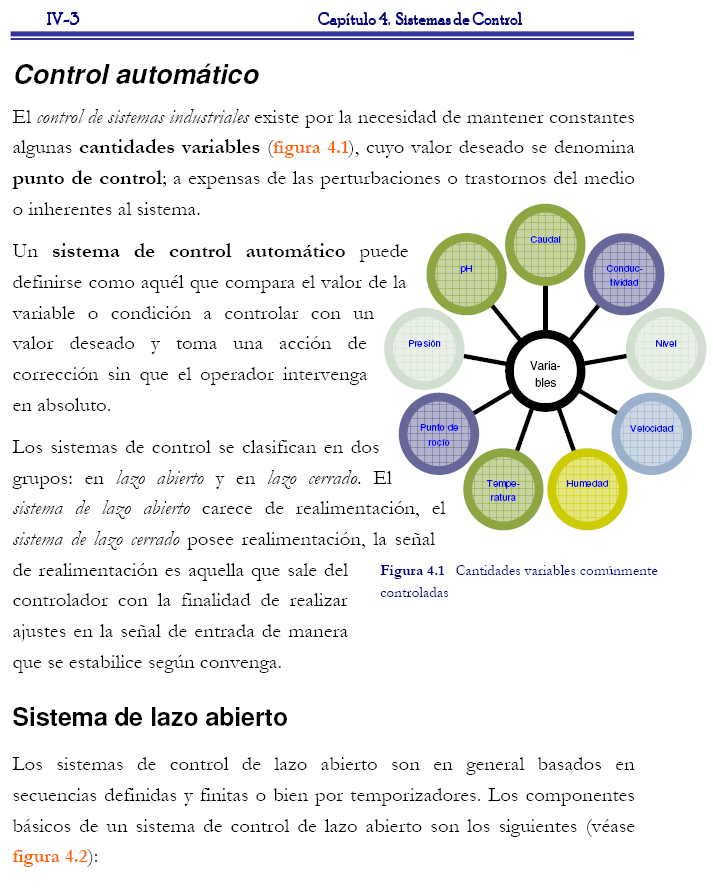

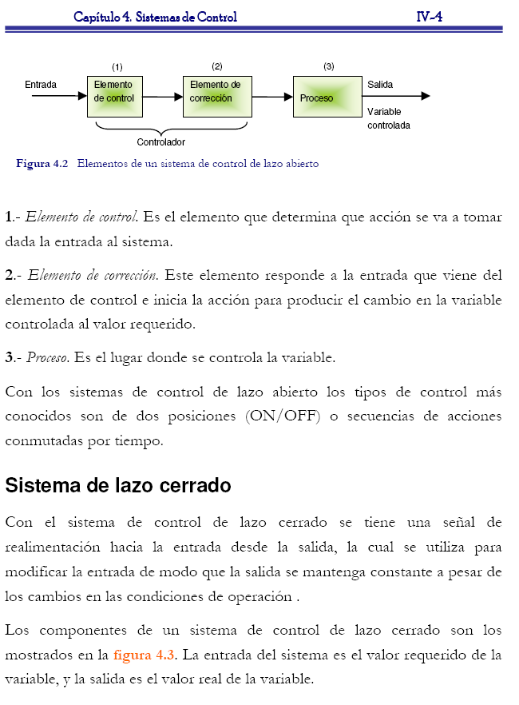

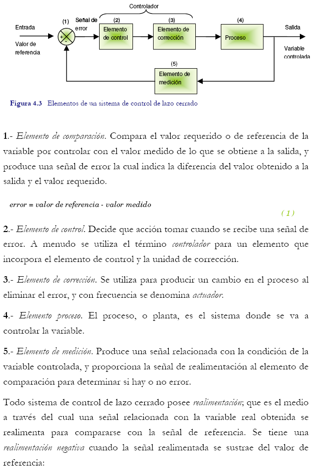

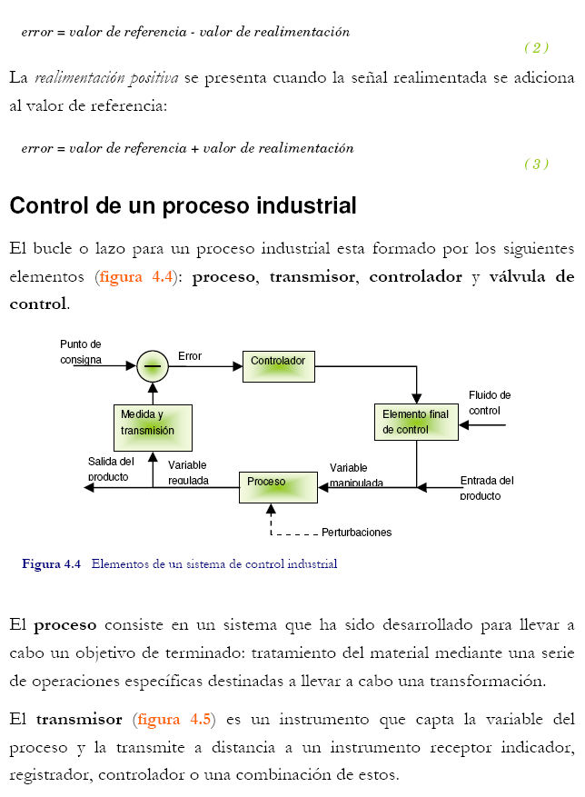

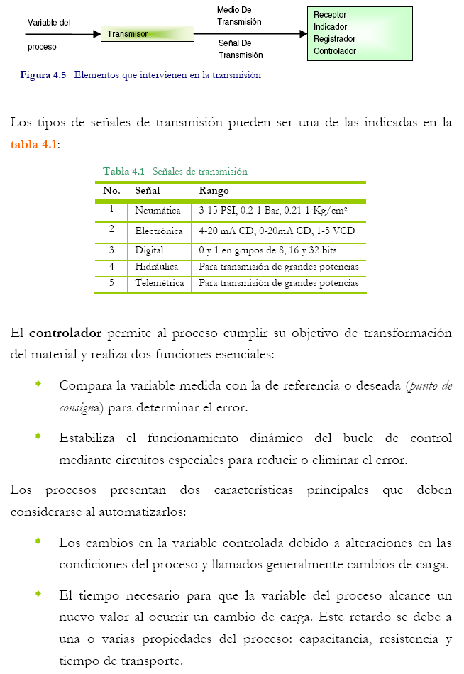

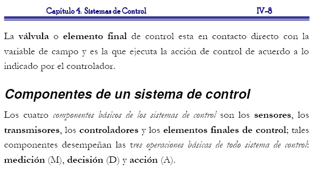

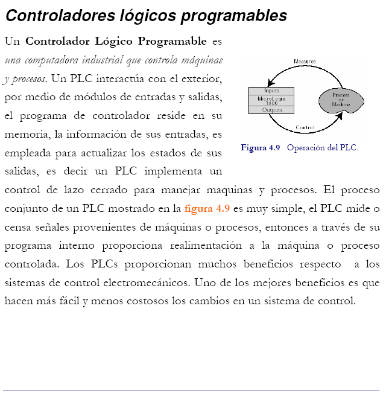

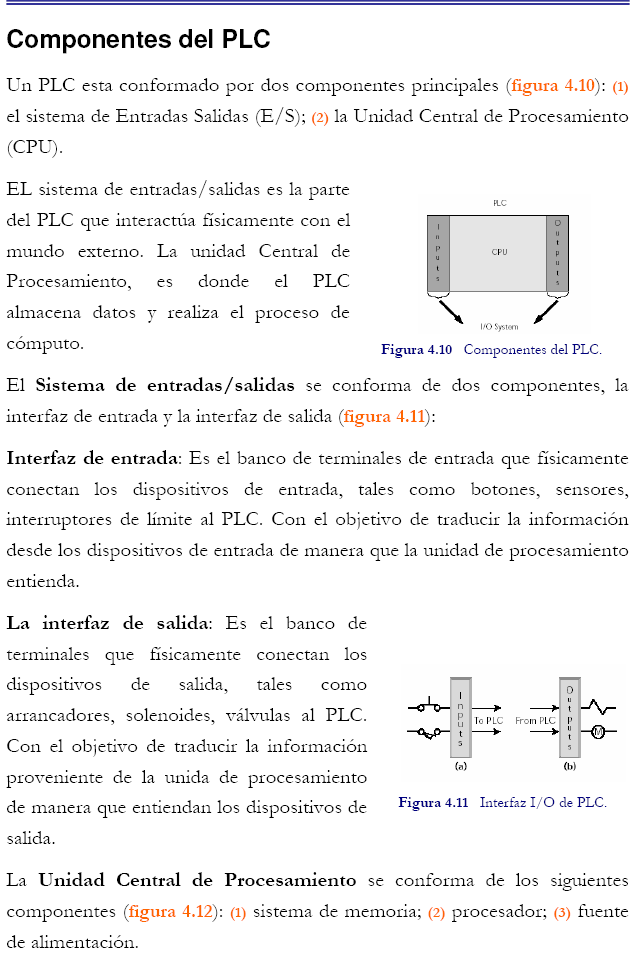

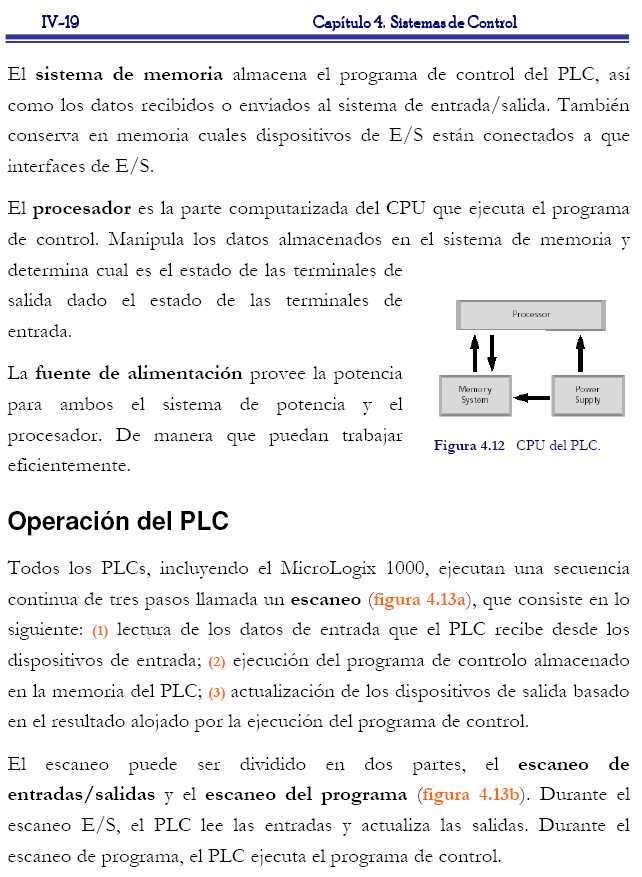

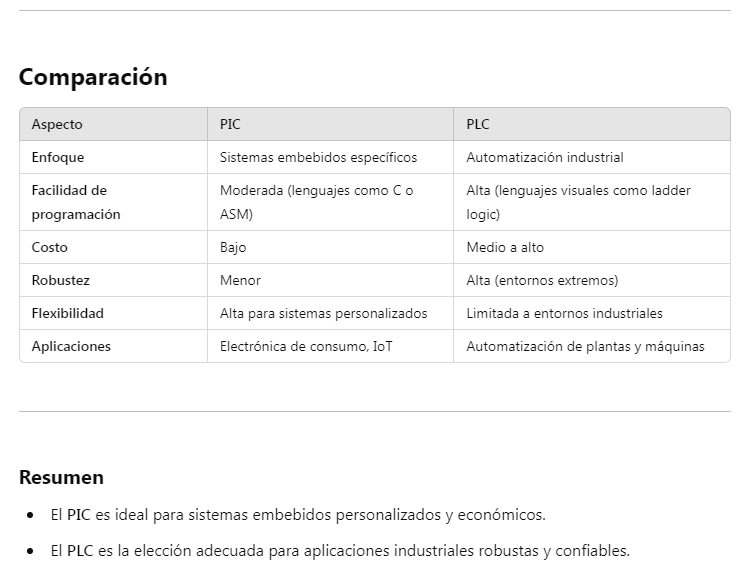

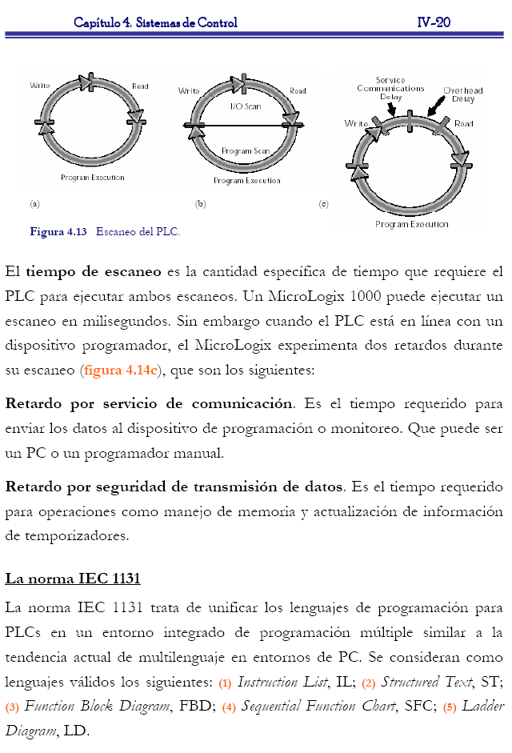

